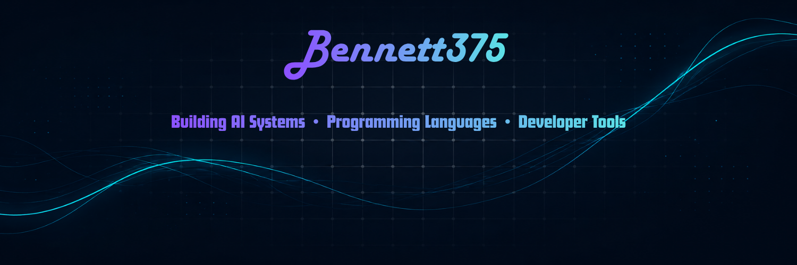

<p align="center">
  
</p>

<br>
<p align="center">
I build experimental systems at the intersection of artificial intelligence, compiler design, and software infrastructure. My projects explore how machines can better understand code, environments, and complex reasoning tasks.
</p>

---

# Current Projects

## System Aware Development Agent

The Agent is an AI-powered development environment assistant designed to automate project setup, dependency management, environment repair, and developer workflow orchestration.

Instead of relying solely on a language model's context window, the system builds a structured representation of a developer's machine, project files, dependencies, toolchains, and runtime environment. This allows the system to reason about the actual state of a project and perform targeted actions to create, configure, repair, and maintain software systems.

### Highlights

* Dependency and environment graph generation
* Project structure and filesystem analysis
* Automated dependency installation and repair
* Build-system and toolchain awareness
* Graph-based context retrieval
* FastAPI backend with desktop integration
* Failure-aware diagnostics and environment reasoning

### Vision

Most coding assistants understand code. This Agent aims to understand the entire development environment.

The long-term goal is to create a system capable of receiving a high-level project request, analyzing the host machine and codebase, determining the necessary steps, executing them safely, and resolving issues until the requested system is operational.

---

## Torrent

Torrent is an experimental programming language and compiler designed for machine learning, scientific computing, and high-performance systems programming.

The project explores what an AI-native language could look like by treating tensors as first-class language constructs rather than library abstractions. Torrent combines Python-like expressiveness, Rust-inspired safety guarantees, and compiler-driven optimization into a unified development experience.

### Highlights

* Tensor-aware type system
* Compile-time shape inference and validation
* Ownership and borrowing semantics
* MLIR-based compilation pipeline
* Static typing with strong correctness guarantees
* Native support for machine learning workloads
* Numerical-computing optimizations

### Compiler Pipeline

```text
Source Code
    ↓
Lexer
    ↓
Parser
    ↓
Abstract Syntax Tree
    ↓
Type Checker
    ↓
Borrow Checker
    ↓
Optimizer
    ↓
MLIR Generation
    ↓
Linalg / MemRef Lowering
    ↓
Native Code
```

### Vision

Torrent explores the future of programming languages for AI.

Its goal is to provide the simplicity of modern scripting languages, the safety of systems languages, and the performance required for large-scale machine learning workloads, while enabling the compiler to reason directly about tensor operations and mathematical structure.

---

# Technologies

### Languages


### AI & Machine Learning


### Frontend


### Databases


---

# Areas of Interest

* Artificial Intelligence
* Autonomous Agents
* Compiler Design
* Programming Languages
* Knowledge Systems
* Developer Tooling
* Computer Vision
* Robotics

---

# Contact

GitHub Discussions and Issues are the best way to reach me regarding projects.
